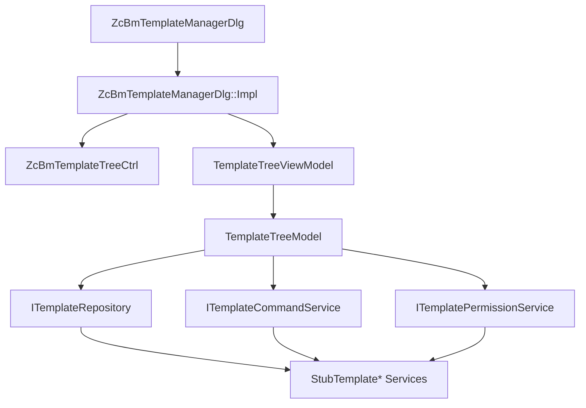
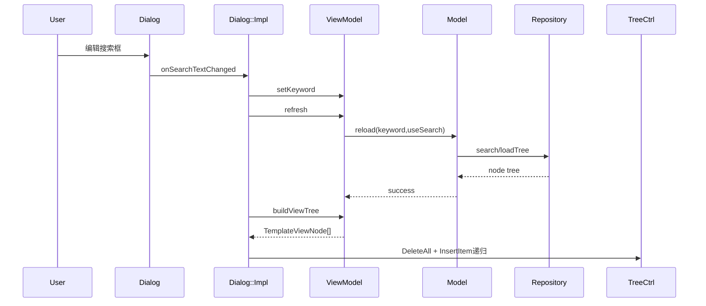
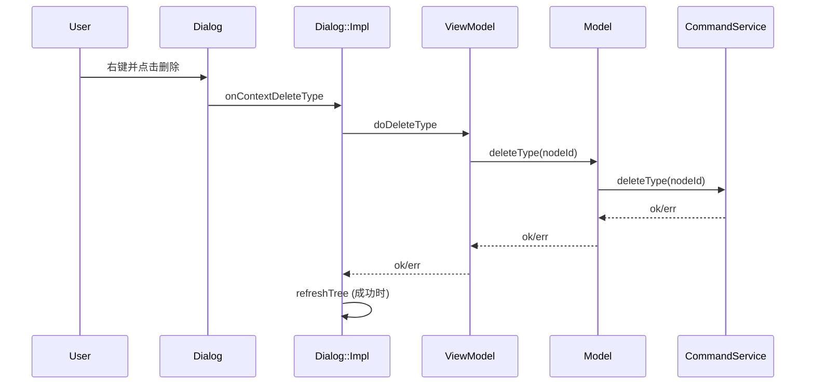

# ZcBmTemplateManager 框架详细说明

## 1. 文档目的

本文档用于系统说明当前 `ZcBmTemplateManager` 的实现框架，重点回答：

- 代码分了哪些层，每层做什么
- 每个核心类具体职责是什么
- 一次用户操作在各层是如何流转的
- 现在的数据结构为何采用 `NodeId` 关系而非 `HTREEITEM` / 智能指针关系
- 后续接入真实业务时，应该改哪里、不该改哪里

适用文件范围（当前实现）：

- `mfc/inc/Dialog/template_manager_dialog.h`
- `mfc/src/template_manager_dialog.cpp`
- `mfc/inc/Control/template_tree_ctrl.h`
- `mfc/src/template_tree_ctrl.cpp`
- `mfc/inc/ViewModel/template_tree_view_model.h`
- `mfc/src/template_tree_view_model.cpp`
- `mfc/inc/Model/template_tree_model.h`
- `mfc/src/template_tree_model.cpp`
- `mfc/inc/Services/template_manager_backend.h`
- `mfc/src/template_manager_backend.cpp`

---

## 2. 总体架构（分层）

当前采用“UI + ViewModel + Model + Backend Interface/Impl”的分层结构，类似 Qt Model/View 的思想，但保留 MFC 消息机制。

### 2.1 分层边界

- `Dialog/TreeCtrl`：负责界面控件、消息响应、绘制与选择行为
- `ViewModel`：负责 UI 语义（当前选中能做什么、如何构建可见树）
- `Model`：负责读写数据入口与权限入口（不关心 UI）
- `Backend`：负责真实业务（当前是 Stub，后续替换）

---

## 3. 核心数据结构设计

定义在 `mfc/inc/Services/template_manager_backend.h`。

## 3.1 `TemplateNodeId`

- 类型：`std::uint64_t`
- 作用：节点稳定主键（当前为占位类型）
- 设计意义：UI 通过 `SetItemData(hItem, nodeId)` 仅绑定 ID，不绑定业务对象

> 后续可替换为 `ZcDbObjectId` 包装类型，只要保持“可比较、可哈希、可稳定定位”即可。

## 3.2 `TemplateNode`

- `m_nodeId`：节点唯一 ID
- `m_name`：显示名
- `m_type`：节点类型（顶层分类/子分类/模板/类型）
- `m_loadState`：加载状态
- `m_isSystem`：是否系统节点
- `m_parentId`：父节点 ID
- `m_children`：子节点 ID 列表

### 为什么 `m_parentId + m_children` 不用智能指针

- 树关系天然是“引用关系”，ID 更稳定，适合增量刷新和持久化
- 避免 `shared_ptr/weak_ptr` 生命周期复杂度和循环依赖风险
- 可直接用于序列化、缓存、跨线程/跨模块传输

## 3.3 `TemplateNodeRoot`

- `m_rootNodeIds`：顶层根 ID 集合
- `m_nodeIndex`：`NodeId -> Node` 索引

说明：

- 从模型语义看，`TemplateNodeRoot` 只是“根 + 索引”的容器
- 可保留（语义清晰），也可后续下沉到 `TemplateTreeModel` 成员

---

## 4. 类与职责详解

## 4.1 `ZcBmTemplateManagerDlg`（壳层）

文件：

- `mfc/inc/Dialog/template_manager_dialog.h`
- `mfc/src/template_manager_dialog.cpp`

职责：

- 只暴露 MFC 消息接口（`onSearch...` / `onTree...` / `onContext...`）
- 通过 PImpl 隐藏实现细节，头文件尽量轻

关键点：

- 成员只有 `std::unique_ptr<Impl> m_impl`
- 这使编译依赖和头文件暴露最小化

## 4.2 `ZcBmTemplateManagerDlg::Impl`（对话框真实逻辑）

职责：

- 持有控件成员：搜索框、树、按钮
- 持有数据层对象：backend bundle、model、viewModel
- 负责将 ViewModel 结果渲染到树控件
- 负责把控件选中状态同步回 ViewModel

核心方法：

- `refreshTree()`：刷新数据并重建 UI 树
- `rebuildTree()`：清空树并按 `TemplateViewNode` 重建
- `insertViewNode()`：递归插入树节点
- `syncSelectionFromTree()`：将 `HTREEITEM` 选中转换为 `NodeId` 选中
- `showContextMenu()`：按焦点节点类型动态拼菜单

## 4.3 `ZcBmTemplateTreeCtrl`（交互控件）

文件：

- `mfc/inc/Control/template_tree_ctrl.h`
- `mfc/src/template_tree_ctrl.cpp`

职责：

- 处理树的多选交互（Ctrl/Shift）
- 处理右键选择修正
- 处理自定义绘制（多选高亮）
- 处理键盘快捷键（Ctrl+A/F2）

注意：

- 它不关心业务数据来源，只关心树项和选中行为
- 业务身份只通过 `SetItemData` 的 `NodeId` 传递

## 4.4 `TemplateTreeViewModel`（UI 语义层）

文件：

- `mfc/inc/ViewModel/template_tree_view_model.h`
- `mfc/src/template_tree_view_model.cpp`

职责：

- 管理 UI 状态：关键词、显示未加载、当前选中/焦点
- 通过 `buildViewTree()` 输出“可见树”
- 提供动作入口：`doBatchLoad/doRename/doPlace...`
- 提供判定入口：`canPlaceFocused()/canRenameFocused()`

它不直接访问控件句柄，也不调用 MFC API。

## 4.5 `TemplateTreeModel`（数据访问协调层）

文件：

- `mfc/inc/Model/template_tree_model.h`
- `mfc/src/template_tree_model.cpp`

职责：

- 聚合 Repository / Command / Permission 三类服务
- 提供统一数据读取入口（`reload/findNode`）
- 提供统一命令入口（`batchLoad/createType/rename...`）
- 提供统一权限入口（`canPlace/canRename...`）

它不负责 UI 策略，只负责“调用哪个服务”。

## 4.6 Backend 接口与 Stub 实现

文件：

- `mfc/inc/Services/template_manager_backend.h`
- `mfc/src/template_manager_backend.cpp`

接口职责：

- `ITemplateRepository`：读模型（全量树/搜索/按 ID 读）
- `ITemplateCommandService`：写操作（新建/复制/删除/重命名/保存/布置）
- `ITemplatePermissionService`：权限判断

当前 Stub 行为：

- Repository：返回内置静态树；搜索做递归过滤
- CommandService：绝大多数操作返回“未实现”
- PermissionService：默认全放行

---

## 5. 关键交互时序

## 5.1 搜索输入变化

## 5.2 右键菜单命令（以“删除类型”为例）

---

## 6. 为什么它比 `HTREEITEM -> NodeInfo` 更适合演进

旧方式问题：

- `HTREEITEM` 是 UI 句柄，树重建后会变化
- 业务索引跟 UI 生命周期绑定，不适合持久化和跨视图
- 做展开态/选中态恢复很麻烦

当前方式优势：

- 业务唯一键是 `TemplateNodeId`
- UI 句柄只是临时渲染产物
- 重建树后可以通过 ID 稳定定位
- 便于未来做增量刷新、事件驱动同步、多视图共享模型

---

## 7. 当前不足与建议

当前还属于“架构已搭、业务待接”阶段，主要不足：

- CommandService 基本是 Stub
- 部分逻辑仍是全量重建树，尚未做 diff patch
- `TemplateNodeRoot` 是否下沉到 Model 还未最终定版

建议后续步骤：

1. 先接入真实 `Repository`（数据库/文档/文件系统）
2. 再逐步替换各命令接口真实实现
3. 增加事件驱动刷新（模板变更事件 -> 局部刷新）
4. 最后做增量渲染和状态恢复（展开/选中/定位）

---

## 8. 维护约定（建议）

- UI 层不直接调用 backend；必须经 ViewModel/Model
- 树项数据一律通过 `NodeId` 绑定，不绑定业务指针
- 成员变量命名统一 `m_...`
- 新增业务动作先扩接口，再落实现，最后接 UI 菜单

---

## 9. 一句话总结

当前框架已经完成了“**数据驱动 UI 的骨架搭建**”：  
`NodeId` 作为主键，`Dialog/TreeCtrl` 做界面，`ViewModel` 做语义，`Model` 做服务编排，`Backend` 可插拔。后续只需要替换 Stub，即可逐步落地真实族模板业务。

